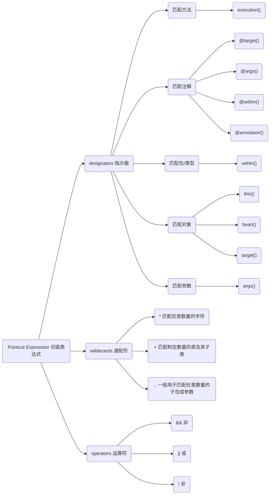

### 什么是AOP？

```
AOP是一种编程范式，不是编程语言，为了解决特定的问题，而不是所有的问题的。
    初衷：1.为了解决代码重复，关注点分离的问题。
    使用AOP的好处：1.集中处理某一关注点/横切面逻辑；2.可以很方便添加/删除关注点
    应用场景：权限控制，缓存控制，事务控制......
```

### 切面表达式



AOP的切面表达式由`三部分`组成，分别是`designators(指示器)`,`wildecards(通配符)`,`operators(运算符)`。这三部分可以简单的概括成从什么地方切入，是从方法，注解还是类型等，然后是对切入的地方进行一些简单的模糊处理，最后是再加上一些逻辑运算限制一下。具体结构如上图所示。

下面对三个组成部分进行简要的说明。

`designators(指示器)`，比如我想写个方法级别注解，只要我在对应的方法上加了该注解，那么我的AOP将对该方法进行切面逻辑处理，此时的指示器就是`匹配注解`的。如果我写了一个AOP只是对某个类的方法进行切面编程，那么指示器就是`匹配方法`的。

`wildecards(通配符)`，可以理解成是AOP的简单模糊匹配，例如，我想对某个包下的类及其方法进行拦截，那么可以用`..`处理，又例如，我们要对一个方法进行拦截，如test(String id)，test(String id，String name)等，只要是test的方法都拦截，但是参数不知道有什么类型和多少种，此时就可以在切面表达式中对方法写成`test(..)`。

`operators(运算符)`，应该来说是最容易理解的，比如想写一个切面表达式拦截两个方法，此时就可以用`||`运算将两个方法合并在一个表达式中。

### AOP原理

```
AOP织入的时机
    1.编译期(Aspectj)
    2.类加载时(AspectJ 5+)
    3.运行时（Spring AOP）
运行时织入是如何实现的呢？
    ——答案是代理实现。

代理
    静态代理
    动态代理
        通过接口实现的代理
        通过继承实现的代理
静态代理的缺点：
    代理越多，重复越多。
    
动态代理：
    JDK代理：
        只能代理接口的
        通过java. lang.reflect.Proxy去动态生成代理类
        实现java.lang.reflect.InvocationHandler完成织入
    cglib代理：
        通过继承的方式实现代理类
        因为基于继承的方式实现代理，所以无法对static，final类进行代理       
        因为基于继承的方式实现代理，所以无法对static，private方法进行代理    
Spring如何选择代理bean?
    如果目标对象实现了接口,则默认采用JDK动态代理
    如果目标对象没有实现接口,则采用Cglib进行动态代理
    如果目标对象实现了接口,且强制cglib代理,则使用cglib代理
    
    在SpringBoot中，启动类加上以下注解强制使用Cglib代理，该注解默认是false
    @EnableAspectJAutoProxy(proxyTargetClass = true)
    
    具体可以看Spring源码
    public class DefaultAopProxyFactory implements AopProxyFactory, Serializable {
        public DefaultAopProxyFactory() {
        }
    
        public AopProxy createAopProxy(AdvisedSupport config) throws AopConfigException {
            if (!config.isOptimize() && !config.isProxyTargetClass() && !this.hasNoUserSuppliedProxyInterfaces(config)) {
                return new JdkDynamicAopProxy(config);
            } else {
                Class<?> targetClass = config.getTargetClass();
                if (targetClass == null) {
                    throw new AopConfigException("TargetSource cannot determine target class: Either an interface or a target is required for proxy creation.");
                } else {
                    return (AopProxy)(!targetClass.isInterface() && !Proxy.isProxyClass(targetClass) ?
                    new ObjenesisCglibAopProxy(config) : new JdkDynamicAopProxy(config));
                }
            }
        }
    
        private boolean hasNoUserSuppliedProxyInterfaces(AdvisedSupport config) {
            Class<?>[] ifcs = config.getProxiedInterfaces();
            return ifcs.length == 0 || ifcs.length == 1 && SpringProxy.class.isAssignableFrom(ifcs[0]);
        }
    }
代理AOP对象

          |--------------|
          |    proxy     |
          |  |--------|  |
[caller]->|->| target |  |
          |  |--------|  |
          |              |
          |--------------|
设计模式
public interface Subject {
    void request();

    void hello();
}

public class ProxySubject implements Subject{

    private RealSubject realSubject;

    public ProxySubject(RealSubject realSubject) {
        this.realSubject = realSubject;
    }

    @Override
    public void request() {
        System.out.println("-------before-------");
        try{
            realSubject.request();
        }catch (Exception e){
            System.out.println("-------ex-------"+e.getMessage());
            throw e;
        }finally {
            System.out.println("-------after-------");
        }
    }

    @Override
    public void hello() {
        realSubject.hello();
    }
}

public class RealSubject implements Subject {

    @Override
    public void request() {
        System.out.println("real ISubject execute request");
    }

    @Override
    public void hello() {
        System.out.println("hello");
    }
}
```

### Spring AOP 的一些坑

```java
1.不宜把重要的业务逻辑放到aop中处理
2.无法拦截static、final方法、private方法
3.无法拦截内部方法调用
//坑3的代码情况
@Service
public class DemoService {

    @Cacheable(cacheNames = {"menu"})
    public List<String> getData(){
        System.out.println("select from database");
        return Arrays.asList("AAA","BBB","CCC");
    }
    
    public List<String> innerCall(){
        return getData();
    }
}
////////////////////////////////////////////////////////
////////////////////   解决方案   ///////////////////////
////////////////////////////////////////////////////////
/**
* 编写一个bean注入到容器中，
* 然后通过该bean去容器获取对应的service的代理对象，
* 用该对象调用缓存的方法。
* 
* 原因：
*   Spring Aop是通过代理实现的，
*   this的引用是bean本身，不是代理对象，
*   我们从IOC容器中获取的bean其实都是代理对象，不是bean本身，
*   更主要的原因是AOP拦截是代理对象，不是bean本身。
*   因此才会出现无法拦截内部方法调用的情况
*/
@Component
public class ApplicationContextHolder implements ApplicationContextAware {

    private static ApplicationContext ctx;

    public static ApplicationContext getContext() {
        return ctx;
    }
    
    @Override
    public void setApplicationContext(ApplicationContext applicationContext) throws BeansException {
        ctx = applicationContext;
    }
}
@Service
public class DemoService {

    @Cacheable(cacheNames = {"menu"})
    public List<String> getData(){
        System.out.println("select from database");
        return Arrays.asList("AAA","BBB","CCC");
    }
    public List<String> innerCall(){
       MenuService proxy = ApplicationContextHolder.getContext().getBean(MenuService.class);
       return proxy.getData();
    }
}
```